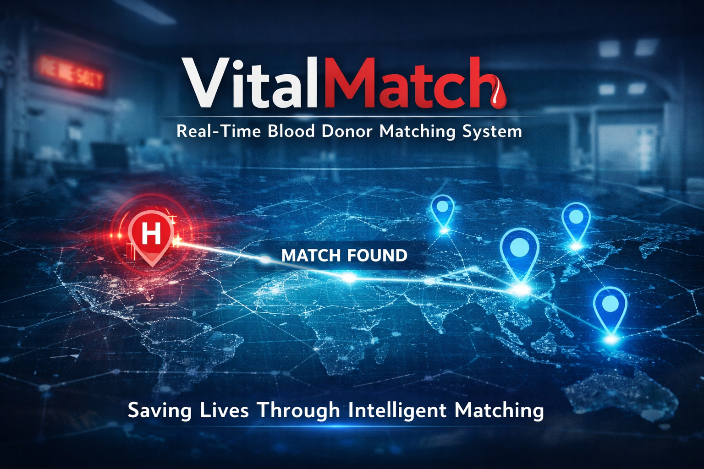

## 📜 License References


# Overview

VitalMatch is a real-time blood donor matching platform designed to connect hospitals with nearby, compatible donors quickly and efficiently.

The system prioritizes proximity, donor reliability, and availability to ensure faster response times and increased chances of successful blood donations.

---



---

## Project Url(s)
- Figma Url:
- Frontend URL: [Frontend-Service URL](https://vitalmatch-buildathon.vercel.app)
- Backend Service: [Backend-Service URL](https://vitalmatch-backend-service.onrender.com)

---

## Test Credentials
Hospital:
username: hospital1
password: test1234

Donor:
username: donor1
password: test1234

---

## Problem
Hospitals often struggle to find compatible blood donors quickly during emergencies. Traditional methods are:

- Slow
- Inefficient
- Manual
- Unreliable

VitalMatch solves this by providing intelligent, real-time donor matching.

---

## Solution
VitalMatch enables hospitals to:

- Create blood requests instantly
- Automatically find nearby donors
- Notify and receive responses from donors
- Track fulfillment progress in real time
- Confirm donations and reward donors

---

## Core Features
**Hospital Features**
- Create blood requests
- View all requests (dashboard)
- Track fulfillment progress (open → partial → completed)
- View matched donors with contact details
- Retry matching when no donors are available
- Confirm donations

**Donor Features**
- Register and login
- Set availability
- Receive blood donation requests
- Accept requests
- View donation history
- Earn reward points

**Intelligent Matching Engine**
- Distance-based matching (Haversine formula)
- Reliability scoring (successful donations)
- Activity scoring (reward points)
- Explainable matching (“why this donor”)

**Notifications**
- Donor receives confirmation notifications
- Hospital sees donor responses
- Keeps both parties informed in real-time

---

## How it works
1. Hospital creates a blood request
2. System finds and ranks nearby donors
3. Donors receive and accept requests
4. Hospital views accepted donors
5. Hospital confirms donation
6. System:
     - Updates fulfillment progress
     - Rewards donor
     - Updates donor reliability

---

## Verification (Interswitch)
- Interswitch (CAC verification)

---

## System Design
- Secure authentication (JWT)
- Role-based access (Hospital vs Donor)
- Service-based architecture (matching logic separated)
- Real-time fulfillment tracking
- Scalable matching algorithm

---

## Tech Stack
- **Backend**: Django + Django REST Framework
- **Database**: PostgreSQL (SQLite for local dev)
- **Frontend**: React
- **Notifications**: (notifications are mocked in MVP)
- **Deployment**: Render, Vercel
- **ThirdPrty-Intehration**: Interswitch API

---

## Team Contributions

- Olajide Ojo (Backend Engineer)
  - Designed system architecture
  - Built authentication (JWT)
  - Implemented matching engine (Haversine + scoring)
  - Developed APIs (requests, retry, confirmation, notifications)
  - Integrated CAC verification API

- [Teammate Name] (Frontend Developer)
  - Built user interface
  - Integrated backend APIs
  - Designed dashboards

- [Teammate Name] (UI/UX Designer)
  - Designed Figma prototypes
  - Created user flows and experience

- [Teammate Name] (Product/Research)
  - Defined problem scope
  - Conducted user research
  - Shaped product direction

---

## Future Improvements
- Real-time notifications (WebSockets)
- Payment/reward withdrawal system
- AI-based demand prediction
- Integration with national blood banks

---

## Local Setup for backend service

```bash
# Clone the repository locally
git clone <repo-url>
cd vitalmatch-buildathon/backend


# Set up virtual environment
python -m venv venv

# Activate virtual environment
source venv/bin/activate  

# or 
env\Scripts\activate on Windows

# Install dependencies
pip install -r requirements.txt

# Run migration
python manage.py migrate

# Start the server
python manage.py runserver
```

### Access Swagger docs at

```http://127.0.0.1:8000/swagger/```

---

## Local Setup for frontend service

---

## What Makes Us Different

- Intelligent donor ranking (not random matching)
- Retry system for failed matches
- Real-time fulfillment tracking
- Explainable matching decisions
